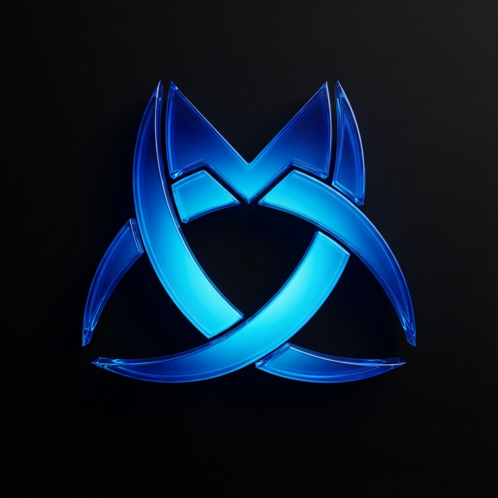

# M3Chat

<div align="center">



**A modern AI chat application powered by Mistral AI**

[](https://nextjs.org/)
[](https://reactjs.org/)
[](https://convex.dev/)
[](https://mistral.ai/)
[](LICENSE)

</div>

---

## ✨ Features

### 🤖 AI-Powered Conversations
- Multiple Mistral AI models (Small, Medium, Large, Codestral)
- Real-time streaming responses
- Customizable AI personality
- Context-aware conversations

### 📁 RAG (Retrieval-Augmented Generation)
- File uploads (PDF, TXT) with automatic text extraction
- Vector embeddings for semantic search
- File context integration in conversations
- Per-conversation file management

### 🔐 Authentication & Security
- WorkOS AuthKit integration
- Secure session management
- User profile customization
- Profile image uploads

### 💬 Chat Experience
- Markdown rendering with syntax highlighting
- Conversation history & management
- Smart conversation search
- Typewriter effect for welcome screen

### ⚙️ User Settings
- Model selection per user
- Custom AI personality prompts
- Account management
- Password reset via email

---

## 🛠️ Tech Stack

| Category | Technology |
|----------|------------|
| **Frontend** | Next.js 16, React 19, TypeScript |
| **Styling** | Tailwind CSS 4, Radix UI |
| **Backend** | Convex (Serverless DB + Functions) |
| **AI** | Mistral AI SDK |
| **Auth** | WorkOS AuthKit |
| **State** | TanStack Query (React Query) |
| **Utilities** | Zod, Streamdown, Lucide Icons |

---

## 🚀 Getting Started

### Prerequisites

- Node.js 18+ 
- npm, yarn, pnpm, or bun
- Convex account
- WorkOS account
- Mistral AI API key

### Installation

1. **Clone the repository**
   ```bash
   git clone https://github.com/yourusername/m3chat.git
   cd m3chat
   ```

2. **Install dependencies**
   ```bash
   npm install
   ```

3. **Set up environment variables**
   
   Copy the example environment file and fill in your credentials:
   ```bash
   cp example-env.txt .env.local
   ```

   Required environment variables:
   ```env
   # Convex
   CONVEX_DEPLOYMENT=your-convex-deployment
   NEXT_PUBLIC_CONVEX_URL=your-convex-url

   # Mistral AI
   MISTRAL_API_KEY=your-mistral-api-key

   # WorkOS Authentication
   NEXT_PUBLIC_WORKOS_CLIENT_ID=your-workos-client-id
   WORKOS_API_KEY=your-workos-api-key
   WORKOS_COOKIE_PASSWORD=your-cookie-password
   NEXT_PUBLIC_WORKOS_REDIRECT_URI=your-redirect-uri
   ENVIRONMENT=development
   ```

4. **Initialize Convex**
   ```bash
   npx convex dev
   ```

5. **Start the development server**
   ```bash
   npm run dev
   ```

6. **Open the app**
   
   Navigate to [http://localhost:3000](http://localhost:3000)

---

## 📁 Project Structure

```
m3chat/
├── app/                    # Next.js App Router
│   ├── api/               # API routes (chat, file extraction, etc.)
│   ├── auth/              # Authentication pages
│   ├── chat/              # Chat interface
│   ├── components/        # React components
│   │   ├── aside-bar/     # Sidebar navigation
│   │   ├── chat-input/    # Message input component
│   │   ├── file-list/     # Attached files display
│   │   ├── messages/      # Message display
│   │   └── settings/      # User settings modal
│   └── welcome/           # Landing page
├── convex/                # Convex backend
│   ├── schema.ts          # Database schema
│   ├── conversations.ts   # Conversation mutations/queries
│   ├── messages.ts        # Message mutations/queries
│   ├── files.ts           # File upload handling
│   └── fileEmbeddings.ts  # RAG embeddings logic
├── hooks/                 # Custom React hooks
├── lib/                   # Utilities & configurations
│   ├── mistralConfig.ts   # AI model configuration
│   └── utils/             # Helper functions
└── public/                # Static assets
```

---

## 🔧 Available Scripts

| Command | Description |
|---------|-------------|
| `npm run dev` | Start development server |
| `npm run build` | Build for production |
| `npm run start` | Start production server |
| `npm run lint` | Run ESLint |
| `npx convex dev` | Run Convex development server |

---

## 🤝 Contributing

Contributions are welcome! Please feel free to submit a Pull Request.

1. Fork the repository
2. Create your feature branch (`git checkout -b feature/amazing-feature`)
3. Commit your changes (`git commit -m 'Add some amazing feature'`)
4. Push to the branch (`git push origin feature/amazing-feature`)
5. Open a Pull Request

---

## 📄 License

This project is licensed under the MIT License - see the [LICENSE](LICENSE) file for details.

---

## 👤 Author

**Sanjay Mathew**

---

<div align="center">

Made with ❤️ using Next.js and Mistral AI

</div>
